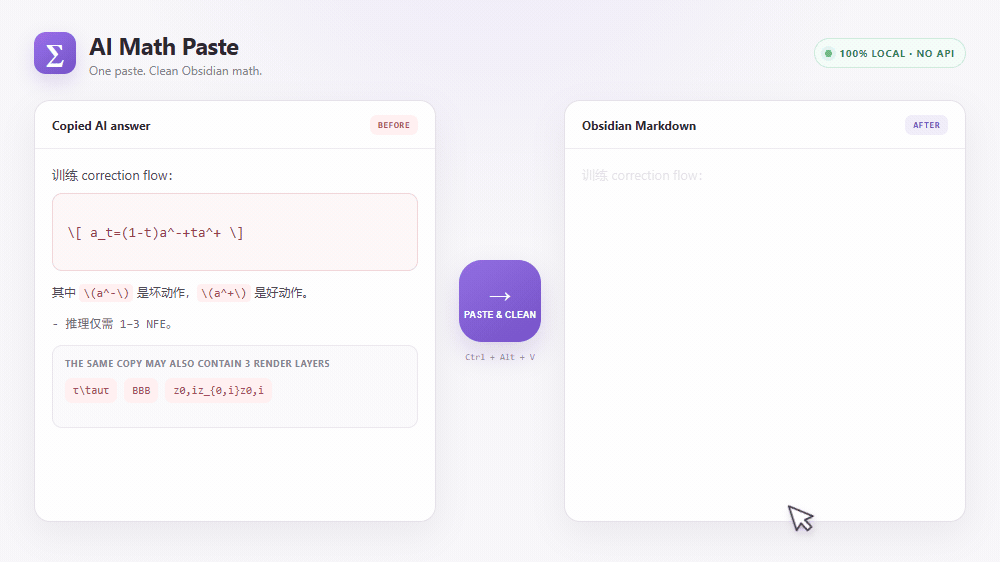

# AI Math Paste

将 AI 助手和网页中的数学内容粘贴到 Obsidian，自动修复重复公式和损坏的 LaTeX 分隔符。



AI Math Paste 是一个极轻量、完全本地运行的 Obsidian 桌面插件。剪贴板仍含 MathML annotation 时，它会恢复 canonical LaTeX 并删除重复的可视渲染层；网站复制按钮删掉这些元数据，甚至把 `\\[...\\]`、`\\(...\\)` 的反斜杠一起剥掉时，它会根据纯文本结构保守恢复高置信公式分隔符。

## 它解决什么问题

从 AI 对话复制公式时，剪贴板有时会同时包含同一公式的可视文本、MathML 和 LaTeX，粘贴后变成：

```text
τ\tauτ
BBB
z0,iz_{0,i}z0,i
```

当富文本剪贴板含有可靠的 `application/x-tex` annotation 时，插件会恢复为：

```markdown
$\tau$
$B$
$z_{0,i}$
```

它也会将 `\(...\)` 转换成 `$...$`，将 `\[...\]` 转换成 `$$...$$`，并保护代码块、行内代码、列表、引用、表格和已有的美元符号公式。

新版 ChatGPT 复制按钮还可能产生：

```text
[
(c_t,\ a_t,\ c_{t+1})
]

由 (m_\eta) 计算。
```

插件会先恢复这个独立公式块和具有强数学特征的行内公式，再转换成 Obsidian 数学格式；有歧义的 `(q)` 会原样保留。

## 使用方法

1. 从 AI 对话或网页复制包含公式的文本。
2. 将光标放在 Markdown 编辑视图中。
3. 在命令面板运行 **Paste and clean AI math**，或者点击侧边栏的 sigma 图标。

存在选区时，同一个命令会修复选区，不会插入新的剪贴板文本。

根据 Obsidian 社区插件规范，公开版本不设置默认快捷键。建议自行绑定：

- Windows：`Ctrl+Alt+V`
- macOS：`Cmd+Option+V`

## 保守原则

- 富文本 HTML 中存在 TeX annotation：用 canonical LaTeX 替换整个渲染公式节点。
- 没有可靠 annotation：转换明确的分隔符；只有内容包含强 LaTeX 或数学信号时，才恢复被剥掉的方括号或圆括号分隔符。
- 不会凭文本外观猜测普通的 `BBB` 是公式。

## 兼容情况

- 首个版本仅支持桌面端。
- 已在 Windows 上使用含 annotation 和不含公式元数据的 ChatGPT/Codex 剪贴板内容验证。
- 其他网站只要在剪贴板 HTML 中提供 MathML 或 KaTeX TeX annotation，原则上即可处理。欢迎提交 Claude、Gemini、DeepSeek、Perplexity 和论文网站的测试样例。

## 隐私

插件完全在 Obsidian 内本地运行，不调用 AI API，不发送网络请求，不需要账户，没有分析或遥测。剪贴板只在内存中处理，插件不会保存其内容。

## 安装

官方社区目录首发正在准备中。Beta 阶段可使用 [BRAT](https://github.com/TfTHacker/obsidian42-brat)，添加下面的仓库地址：

```text
https://github.com/8august8/obsidian-ai-math-paste
```

## 开发

```bash
npm install
npm run check
```

`npm run check` 会执行代码检查、单元测试、类型检查和生产构建。生成的 `main.js` 只上传到 GitHub Release，不提交到源码仓库。

## 许可证

[MIT](LICENSE)
